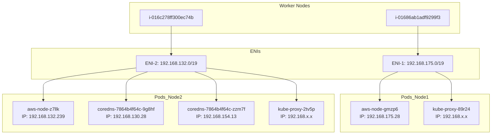

# How CNI Works in EKS 

CNI = Container Network Interface -> A Kubernetes plugin that handles pod networking. 

In AWS EKS with the **AWS VPC CNI** plugin, the CNI essentially uses **ENIs and their IPs to provide network connectivity to pods.**

## ENIs in EKS 
- **Control Plane ENIs**: Managed by AWS EKS, live inside private subnets, connect to Kubernetes API servers. 
- **Worker Node ENIs**: Belong to your EC2 instance (nodes) running workloads (Pods).
- **Unattached ENIs**: Might be leftover from scaling events, node replacement, or pending attachment. 

## What an ENI really is in AWS/EKS 

- The subnet is just an IP pool + AZ location (metadata).
- The **ENI** lives inside a single subnet and "borrows" IPs from it (IP Pool/Subnet).
- The Worker Node gets network access through the ENI(s) attached to it. 

### Relationships of VPC & ENI & EKS's Worker Node(EC2 Instance)

**VPC:Subnets => 1:N, ENI:Subnets(CIDR) => 1:1; (EKS)Worker Node : ENI => 1:N;  Each ENI belongs to exactly subnet. That subnet has a range of available IP addresses, and the ENI can take one primary + multiple secondary IPs from that pool. Each Worker Node can have one to multiple ENI(s).**

Worker Node (EC2 instance) doesn't **"own"** a subnet directly. 
The relationship works like this: 

```
VPC
 └── Subnet (IP range)
      └── ENI (Elastic Network Interface)
           └── Attached to Worker Node
```


```
ENI-12345  →  Subnet-abcde (192.168.128.0/19)
             ├── Primary IP: 192.168.128.48
             ├── Secondary IP: 192.168.128.49
             ├── Secondary IP: 192.168.128.50
             └── ...
```

- **ENI** = Elastic Network Interface -> a virtual network card for an EC2 instance (including EKS worker nodes).
- One **ENI** is always tied to exactly one subnet. 
- One **ENI** can have: 
> One primary private IPv4(required)
> Multiple secondary private IPv4s (depending on instance type)
> Optionally one public IPv4 (if in public subnet or NAT config)
> IPv6 addresses if enabled. 


## Get EKS VPC Output Content 

```bash 
$ eksdemo get vpc
+-----------------------+--------------------------------------+--------------------------------------+-----------------+-------------+
| Id                    | Name                                 | IPv4 CIDR(s)                         | IPv6 CIDR(s)    |
+-----------------------+--------------------------------------+--------------------------------------+-----------------+-------------+
| vpc-068d84bd223c3afd6 | eksctl-kodekloud-cluster/VPC          | 192.168.0.0/16                        | -               |
| vpc-7f711214          | *                                    | 172.31.0.0/16                         | -               |
+-----------------------+--------------------------------------+--------------------------------------+-----------------+-------------+
* Indicates default VPC
```
### `eksdemo get vpc ` Output Explanation 
- **Id**: 
The unique AWS VPC (Virtual Private Cloud) identifier. Each VPC has its own networking configuration. 
- **Name**: 
The human-readable name for the VPC.
-- `eksctl-kodekloud-cluster/VPC` -> VPC created for the EKS cluster. 
-- `*` -> Marks the **default VPC** in the AWS region. 

- **IPv4 (CIDRs)**
The IP address range (in CIDR notation) allocated for the VPC.
Example: `192.168.0.0/16` means the VPC has IP addresses from `192.168.0.0` to `192.168.255.255`. 

- **IPv6 (CIDRs)**
IPv6 address range (if assigned). Here, it's -- because no IPv6 range is set. 

- **Indicates default VPC**
Default AWS-provided VPC in each region; automatically created. 


## Get EKS Subnet Output Content 

```bash 
$ eksdemo get subnets
+-----------------------+-----------+-------------------+-------+-------------+
| Id                    | Zone      | IPv4 CIDR         | Free  | IPv6 CIDR   |
+-----------------------+-----------+-------------------+-------+-------------+
| subnet-0ea8d9460384a28ec | us-west-2d | 192.168.0.0/19   | 8186  | -           |
| subnet-7e711215          | us-west-2c | 172.31.0.0/20    | 4091  | -           |
| subnet-0985f0fac4aa78207 | us-west-2d | 192.168.96.0/19  | 8186  | -           |
| subnet-2fd03704          | us-west-2d | 172.31.48.0/20   | 4091  | -           |
| subnet-7d711216          | us-west-2b | 172.31.32.0/20   | 4091  | -           |
| subnet-01c03526c3f1b6af6 | us-west-2a | 192.168.128.0/19 | 8162  | -           |
| subnet-0a663a22dfed643a3 | us-west-2a | 192.168.160.0/19 | 8175  | -           |
| subnet-01945f721bd2414f8 | us-west-2a | 192.168.32.0/19  | 8187  | -           |
| subnet-087eb1ba567a91170 | us-west-2a | 192.168.64.0/19  | 8187  | -           |
| subnet-7c711217          | us-west-2a | 172.31.16.0/20   | 4091  | -           |
+-----------------------+-----------+-------------------+-------+-------------+
```
### `eksdemo get subnets ` Output Explanation 

- **Id**
Unique AWS Subnet ID within the VPC. Each subnet is tied to a specific available zone. 

- **Zone**
AWS Availability Zone (AZ) where the subnet resides. Example: `us-west-2a`.

- **IPv4 CIDR**
The IP address range for that subnet, a smaller portion of the VPC CIDR block. 

- **Free**
Number of available IP addresses left in the subnet for resource allocation (pod, nodes, services, etc.).

- **IPv6 CIDR**
IPv6 range for the subnet; here all are -- (no IPv6 configured). 
 


---  

## Get EKS network-interface Output Content 

```bash
$ eksdemo get network-interface
+-----------------------+----------------------+-------------------+-------------------+--------------------+--------------------------+
| Network Interface Id  | Attached Instance Id | Private IPv4 IPs  | Subnet Id         | Security Groups    | Description              |
+-----------------------+----------------------+-------------------+-------------------+--------------------+--------------------------+
| eni-00e9e764699ac1660  | i-016c278ff300ec74b  | 192.168.128.48    | subnet-01c03526c3f1b6af6 | sg-xxxxxxx   | eks_control_plane         |
| eni-0a671da155a4e7c6a  | i-016c278ff300ec74b  | 192.168.141.232   | subnet-01c03526c3f1b6af6 | sg-xxxxxxx   | Secondary interface       |
| *eni-067f3789c01231e63 | i-016c278ff300ec74b  | 192.168.132.239   | subnet-01c03526c3f1b6af6 | sg-xxxxxxx   | Primary network interface |
| eni-0e8fb35f8a29f6d35  | i-01686ab1adf9299f3  | 192.168.175.28    | subnet-0a6e36a22dfe64a3a | sg-xxxxxxx   | Worker node               |
| eni-0a2ee2424b0d3f1a2  | i-01686ab1adf9299f3  | 192.168.19.171    | subnet-0ea8d9460384a28ec | sg-xxxxxxx   | Worker node               |
| eni-0b6920863c674eae7  | -                    | -                 | subnet-0985f0fac4aa78207 | sg-xxxxxxx   | Unattached / Available    |
+-----------------------+----------------------+-------------------+-------------------+--------------------+--------------------------+
* Indicates Primary network interface
```


### `eksdemo get network-interface` Output Explanation 
####  **Network Interface Id(ENI)**
- Stands for Elastic Network Interface in AWS 
- Each ENI is a virtual network card attached to an EC2 instance (in this case, EKS control plane or worker node).
- Example: `eni-00e9e764699ac1660`


#### **Attached Instance Id**
- The EC2 instance (either EKS control plane or worker node) to which the ENI is attached. 
- If this field is blank, the ENI is unattached and available for future use/allocate. 

#### Private IPv4 IPs
- The private IP address assigned to this network interface inside the VPC.
- Example: `192.168.128.48` is reachable only inside the VPC.
- Some ENIs can have **multiple IPs** for services or load balancers. 

### Subnet Id
- The subnet where the ENI lives. 
- Determines the IP range available to the ENI. 
- Example: `subnet-01c03526c3f1b6af6`.

### Security Groups 
- Firewall rules attached to this ENI.
- Controls inbound and outbound network traffic. 


### Description 

AWS description field. Often set by EKS to indicate purpose: 
- `eks_control_plane`: Used by the EKS master/control plane. 
- `worker node`: Belongs to EC2 nodes running pods. 
- `unattached`: ENI is created but not in use. 

**before ENI** -> Makes it as the primary network interface for that EC2 instances. 


### Key Notes
Primary vs. Secondary ENIs
- Primary ENI -> Required for EC2 instance networking; can't be detached. 
- Secondary ENI -> Used for extra IPs, load balancers, or pod networking. 


Why EKS has many ENIs
- Each EKS worker node often gets multiple ENIs for pods to have dedicated IPs.
- The control plane has its own ENIs for API and internal communication. 


--- 
## Get EKS Nodes Output Content 
### `k get no ` Output Explanation 
```bash 
$ kubectl get no
+-----------------------------------------------+
| NAME                                          |
+-----------------------------------------------+
| i-01686ab1adf9299f3.us-west-2.compute.internal |
| i-016c278ff300ec74b.us-west-2.compute.internal |
+-----------------------------------------------+
```

### Output Concepts & Explanation 
#### Node(no)
- In Kubernetes, a Node represents a worker machine that runs pods. 
- In EKS, a Node is typically an EC2 instance you launch (or AWS-managed node group launch) to run workloads. 


#### Node Name 
- The name here corresponds to the **EC2 instance ID + region domain**
> `i-01686ab1adf9299f3.us-west-2.compute.internal`
- This naming convention shows: 
> `i-xxxxxxxxxxxx` -> EC2 instance ID.
> `us-west-2` -> AWS region. 
> `.compute.internal` -> internal DNS suffix in the VPC. 


#### Role of Worker Nodes in EKS
- Each Node runs `kubectl(agent)`, which registers it to the Kubernetes API server ( in the control plane)
- Nodes provides compute resources (CPU, memory, network) for pods. 

#### Network Context
- Each Node will have **ENIs** attached (from subsets) for networking. 
- Pods scheduled on the node get **IP addresses from the node's ENIs**, managed by the AWS VPC CNI plugin. 

#### High-level Mapping 

```
EC2 Node (Worker) --> ENI(s) --> Pod(s) --> IP(s)
```

--- 

## Get EKS Pods Output Content 

### `k get po -o wide -A ` 

```bash 
> k get po -o wide -A # kubecto get pods -o wide (show all column descs) -A (all namespace)

+------------+--------------------------+-------+---------+----------+------+----------------+-------------------------------------------+----------------+----------------+
| NAMESPACE  | NAME                     | READY | STATUS  | RESTARTS | AGE  | IP             | NODE                                      | NOMINATED NODE | READINESS GATES|
+------------+--------------------------+-------+---------+----------+------+----------------+-------------------------------------------+----------------+----------------+
| kube-system| aws-node-gmzp6           | 2/2   | Running | 0        | 42m  | 192.168.175.28 | i-01686ab1adf9299f3.us-west-2.compute.internal | <none>         | <none>         |
| kube-system| aws-node-z7llk           | 2/2   | Running | 0        | 42m  | 192.168.132.239| i-016c278ff300ec74b.us-west-2.compute.internal | <none>         | <none>         |
| kube-system| coredns-7864b4f64c-9g8hf| 1/1   | Running | 0        | 49m  | 192.168.130.28 | i-016c278ff300ec74b.us-west-2.compute.internal | <none>         | <none>         |
| kube-system| coredns-7864b4f64c-zzm7f| 1/1   | Running | 0        | 49m  | 192.168.154.13 | i-016c278ff300ec74b.us-west-2.compute.internal | <none>         | <none>         |
| kube-system| kube-proxy-2tv5p         | 1/1   | Running | 0        | 42m  | 192.168.x.x    | i-016c278ff300ec74b.us-west-2.compute.internal | <none>         | <none>         |
| kube-system| kube-proxy-89r24         | 1/1   | Running | 0        | 42m  | 192.168.x.x    | i-01686ab1adf9299f3.us-west-2.compute.internal | <none>         | <none>         |
+------------+--------------------------+-------+---------+----------+------+----------------+-------------------------------------------+----------------+----------------+
```

### EKS `k get po -o wide -A` Output Content Explanation 
- **NAMESPACE** -> Pod namespace (kube-system for system pods)
- **NAME** -> Pod name; e.g., {aws-node, coredns, kube-proxy}
- **READY** -> Containers ready / total containers. 
- **STATUS** -> Pod status (Running, Pending, etc.).
- **RESTARTS** -> Number of container restarts. 
- **AGE** -> How long pod has been running.
- **IP** -> Pod IP allocated from ENI/Subnet of the Worker Node(EC2 Instance). 
- **NODE** -> EC2 instance (worker node) hosting the pod. 
- **NOMINATED NODE** -> For preemption/disruption scheduling (usually <none>).
- **READINESS GATES** -> Extra readiness checks beyond container probes (usually <none>). 

### Cluster Insights from This Table 
- **2 Worker Nodes**: {i-01686ab1adf9299f3 and i-016c278ff300ec74b}
- **aws-node Pods**: Each node has one, managing ENIs and pod IP allocation (VPC CNI plugin).
- **CoreDNS Pods**: Cluster DNS for pods; spread across nodes. 
- **kube-proxy Pods**: Networking for service traffic across nodes. 
- **Pod IPs**: Come from **subnet pools**, assigned by the CNI plugin. 
- **Control Plane**: Managed by AWS, not visible here. 


## Diagrams & Explanation 



### Explanation 
- **Worker Nodes** -> Your EC2 Instances running pods.
- **ENIs** -> Network Interfaces attaches to nodes(EC2 instances), one ENI per one subnet. Pods borrows IPs from IP Pool(subnet) via ENIs, and subnet is a collection of metadata of (IP address + AZ Infos) can be attached only one ENIs. Node fetch/borrow idle ips from subnet via ENIs. 
- **Pods** -> Each pod has an IP assigned from the ENI's subnet. 
- **IP assignment** -> managed by AWS VPC CNI plugin. 